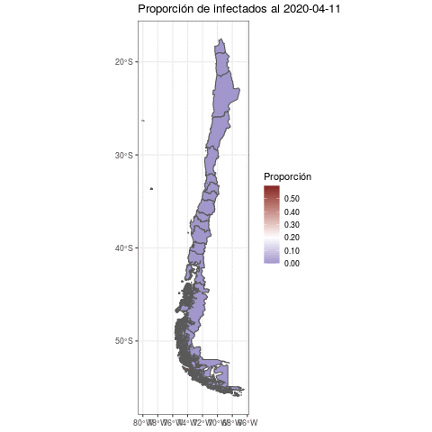

```{r setup, include=FALSE}
knitr::opts_chunk$set(echo = FALSE, warning = FALSE, message = FALSE)
library(tidyverse)
library(sf)
library(kableExtra)
```

## Introducción

Este repositorio tiene los datos y códigos necesarios para generar el modelo espacialmente explicito para la propagación del COVID19 en chile, a continuación se describen los distintos archivos que hay en el repositorio.

## Bases de datos

##### Comunas.rds

Simple feature obtenido de los archivos de la biblioteca nacional con los poligonos de cada comuna, mas la población de cada una de acuerdo al último censo


##### Regiones.rds

Simple feature obtenido de los archivos de la biblioteca nacional con los poligonos de cada Región, mas la población de cada una de acuerdo al último censo, el número de infectados al 19 de marzo y la prevalencia calculada según ambos valores

```{r Mapa}
Regiones <- read_rds("Regiones.rds")
ggplot() + geom_sf(data = Regiones, aes(fill = Prevalencia*100000), size = 0.05) + theme_bw() + scale_fill_gradient2(high = scales::muted("red"), low = scales::muted("blue") ,midpoint =  2,label = scales::comma, name = "Prevalencia") + ggtitle("Prevalencia cada 100,000 habitantes")
```

##### Viajes_Regiones.rds

data.frame con el numero de viajes promedio realizados entre regiones por día, sacado de un promedio de 21 días. El script para genererlo es `MigracionRegion.R`. A continuación vemos las primeras 20 entradas en una tabla.

```{r Tabla}
Viajes <- read_rds("Viajes_Regiones.rds")

knitr::kable(head(Viajes, 20), digits = 2, format = "markdown")
```

```{r red}
require(igraph)


MatrixRegion <- readRDS("MatrixRegion.rds")
graph = graph_from_adjacency_matrix(MatrixRegion, "directed", weighted = T)
E(graph)$width <- E(graph)$weight*500

library(arcdiagram)
# create a star graph with 10 nodes
star_graph = graph.star(10, mode="out")

# extract edgelist
star_edges = get.edgelist(star_graph)


# plot 1: default arc diagram
vlabels = get.vertex.attribute(graph, "label")
op = par(mar = c(0.5, 5, 0.5, 3))

arcplot(igraph::as_edgelist(graph),lwd.arcs=E(graph)$width, labels = vlabels, cex.labels=0.8, horizontal=FALSE)


```


## Modelos


## Outputs


### Lineas de tiempo de infección

```{r}
Results <- read_rds("Results.rds")


Results <- bind_rows(Results) 

Results2 <- Results %>% dplyr::select(Region, Time, Prop_I, Prop_S, Prop_R) %>% pivot_longer(starts_with("Prop"), names_to = "Grupo", values_to = "Proporcion") %>% dplyr::filter(Grupo != "Prop_S") %>% mutate(Time = dmy("17-03-2020") + Time)

#ggplot(Results, aes(x = Time, y = Prop_I)) + geom_line() + facet_wrap(~Region) + theme_classic()

ggplot(Results2, aes(x = Time, y =Proporcion)) + geom_line(aes(color = Grupo)) + facet_wrap(~Region) + theme_classic()
```


### Tablas con peaks de infección


```{r}
Maxs <- Results2 %>% dplyr::filter(Grupo == "Prop_I") %>% dplyr::group_split(Region) %>% purrr::map(~dplyr::filter(.x, Proporcion == max(Proporcion))) %>% reduce(bind_rows) %>% dplyr::select(-Grupo) %>% rename(Proporcion_Infectados = Proporcion)

knitr::kable(Maxs, digits = 2, format = "markdown")
```


```{r gif}

```

