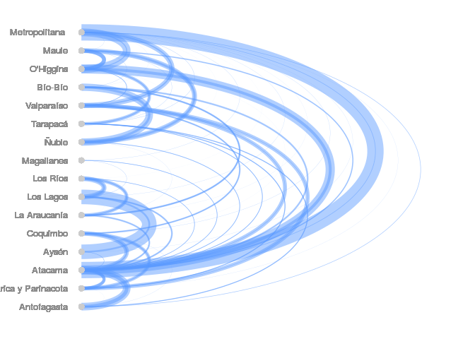

Modelo espacialmente explícito COVID19
================

## Introducción

Este repositorio tiene los datos y códigos necesarios para generar el
modelo espacialmente explicito para la propagación del COVID19 en chile,
a continuación se describen los distintos archivos que hay en el
repositorio.

## Bases de datos

##### Comunas.rds

Simple feature obtenido de los archivos de la biblioteca nacional con
los poligonos de cada comuna, mas la población de cada una de acuerdo al
último censo

##### Regiones.rds

Simple feature obtenido de los archivos de la biblioteca nacional con
los poligonos de cada Región, mas la población de cada una de acuerdo al
último censo, el número de infectados al 19 de marzo y la prevalencia
calculada según ambos valores

<!-- -->

##### Viajes\_Regiones.rds

data.frame con el numero de viajes promedio realizados entre regiones
por día, sacado de un promedio de 21 días. El script para genererlo es
`MigracionRegion.R`. A continuación vemos las primeras 20 entradas en
una
tabla.

| origen                                   | destino                                  | n\_personas |
| :--------------------------------------- | :--------------------------------------- | ----------: |
| Región de Valparaíso                     | Región Metropolitana de Santiago         |    27176.10 |
| Región Metropolitana de Santiago         | Región de Valparaíso                     |    26876.81 |
| Región Metropolitana de Santiago         | Región del Libertador Bernardo O’Higgins |    20039.00 |
| Región del Libertador Bernardo O’Higgins | Región Metropolitana de Santiago         |    19877.19 |
| Región Metropolitana de Santiago         | Región de Atacama                        |    13219.24 |
| Región de Atacama                        | Región Metropolitana de Santiago         |    11941.95 |
| Región del Libertador Bernardo O’Higgins | Región del Maule                         |    10899.86 |
| Región de Ñuble                          | Región del Bío-Bío                       |    10309.14 |
| Región del Maule                         | Región del Libertador Bernardo O’Higgins |    10300.38 |
| Región del Bío-Bío                       | Región de Ñuble                          |     9997.76 |
| Región del Libertador Bernardo O’Higgins | Región de Atacama                        |     7452.90 |
| Región de Atacama                        | Región del Libertador Bernardo O’Higgins |     7330.76 |
| Región del Maule                         | Región de Ñuble                          |     6617.57 |
| Región de Antofagasta                    | Región de Atacama                        |     6193.43 |
| Región de Atacama                        | Región de Antofagasta                    |     6190.33 |
| Región de Ñuble                          | Región del Maule                         |     6186.14 |
| Región de Los Lagos                      | Región de Los Ríos                       |     5268.05 |
| Región de Los Ríos                       | Región de Los Lagos                      |     5208.00 |
| Región de La Araucanía                   | Región del Bío-Bío                       |     4908.90 |
| Región del Bío-Bío                       | Región de La Araucanía                   |     4763.05 |

<!-- -->

## Modelos

## Outputs

<!-- -->

<!-- -->
