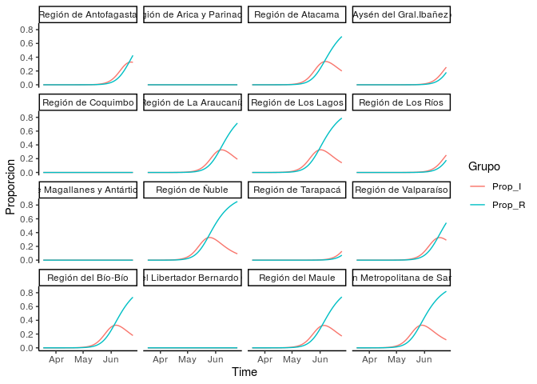

Modelo espacialmente explícito COVID19
================

## Introducción

Este repositorio tiene los datos y códigos necesarios para generar el
modelo espacialmente explicito para la propagación del COVID19 en chile,
a continuación se describen los distintos archivos que hay en el
repositorio.

## Bases de datos

### Comunas

Simple feature obtenido de los archivos de la biblioteca nacional con
los poligonos de cada comuna, mas la población de cada una de acuerdo al
último censo

<!-- -->

### Regiones

Simple feature obtenido de los archivos de la biblioteca nacional con
los poligonos de cada Región, mas la población de cada una de acuerdo al
último censo

<!-- -->

## Modelos

## Outputs
